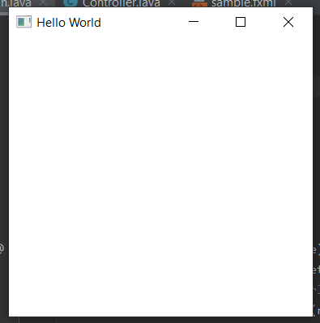

# Hello-World-WissAr-2020
 

 
A simple Hello World Java App.

---

### Voraussetzungen
Vorausgesetzt wird eine Entwicklungsumgebung für die Programmiersprache Java.

### Starten der Anwendung
Durch das Ausführen der Main.java in der Entwicklungsumgebung kann die Anwednung gestartet werden.
